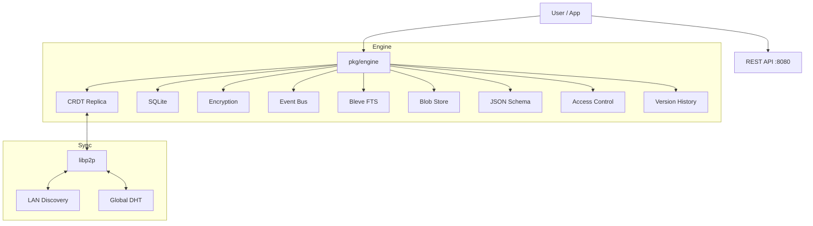

# ACORDE

**ACORDE** (Always-Available Conflict-free Offline-first Replicated Distributed Data Synchronization Engine) is a **local-first**, **peer-to-peer** data synchronization engine built with Go. It enables applications to store data durably offline and sync it securely across devices without a central server.


## ✨ Features

### Core
- **Local-First**: Built on SQLite. Works completely offline.
- **Conflict-Free**: Uses State-based CRDTs (LWW-Set for entries, OR-Set for tags) to merge data automatically.
- **End-to-End Encryption**: XChaCha20-Poly1305 content encryption with Argon2id key derivation.

### Advanced (New in v0.8)
- **Schema Validation**: Define JSON schemas for entry types. Enforced automatically.
- **Versioning**: Full history tracking. Undo changes or audit usage.
- **Access Control**: Owner/Reader/Writer permissions per entry.
- **Multi-Vault**: Manage separate vaults (Work/Personal) in one daemon.
- **Webhooks**: Register HTTP callbacks for real-time events.
- **Import/Export**: Migrate data using JSON, CSV, or Markdown formats.

### Sync
- **mDNS**: Automatic discovery on local LAN.
- **DHT**: Global discovery via Kademlia DHT (optional).
- **Delta Sync**: Only sync entries that changed since last sync (10x faster).
- **Direct Pairing**: QR-code based pairing for trusted devices.

### API
- **Go Library**: Embed `pkg/engine` in your application.
- **REST API**: `acorde serve --port 8080` for any language.
- **Event Subscriptions**: Real-time change notifications via SSE.
- **Query Language**: Filter entries with `type = "note" AND tags CONTAINS "work"`.
- **Full-Text Search**: Search content with Bleve (pure Go).

### Storage
- **Per-Entry Encryption**: Share specific entries with specific peers.
- **Blob Storage**: Content-addressed storage for large files (images, PDFs).

## 📦 Installation

```bash
# Install CLI
go install github.com/amaydixit11/acorde/cmd/acorde@latest

# Or build from source
git clone https://github.com/amaydixit11/acorde.git
cd acorde/cmd/acorde
go build -o acorde .
```

## 🚀 Quick Start

### CLI Mode

```bash
# Initialize encrypted vault
acorde init

# Start sync daemon (P2P)
acorde daemon

# Add data
acorde add --type note --content "Hello World" --tags work,important
acorde list --type note
```

### REST API Mode

```bash
# Start REST server
acorde serve --port 8080

# Use from any language
curl http://localhost:8080/entries
curl -X POST http://localhost:8080/entries \
  -H "Content-Type: application/json" \
  -d '{"type":"note","content":"Hello from API","tags":["test"]}'

# Real-time events (SSE)
curl http://localhost:8080/events
```

### Library Mode

```go
package main

import (
    "log"
    "github.com/amaydixit11/acorde/pkg/engine"
    "github.com/amaydixit11/acorde/pkg/crypto"
)

func main() {
    // Initialize with encryption
    key, _ := crypto.GenerateKey()
    e, _ := engine.New(engine.Config{
        DataDir:       "./data",
        EncryptionKey: &key,
        MaxVersions:   50, // Keep last 50 versions
    })
    defer e.Close()

    // 1. Register Schema (Optional)
    e.RegisterSchema("task", []byte(`{
        "type": "object", 
        "required": ["title"], 
        "properties": {"title": {"type": "string"}}
    }`))

    // 2. Add entry (Validates schema + Sets Owner + Saves Version 1)
    entry, _ := e.AddEntry(engine.AddEntryInput{
        Type:    "task",
        Content: []byte(`{"title": "Buy milk"}`),
        Tags:    []string{"personal"},
    })
    log.Printf("Created: %s", entry.ID)

    // 3. Update entry (Checks ACL + Validates + Saves Version 2)
    newContent := []byte(`{"title": "Buy almond milk"}`)
    e.UpdateEntry(entry.ID, engine.UpdateEntryInput{
        Content: &newContent,
    })

    // 4. Inspect History
    history, _ := e.Versions().GetHistory(entry.ID)
    log.Printf("Versions: %d", len(history)) // 2

    // 5. Query entries
    results, _ := e.Query(`type = "task" AND tags CONTAINS "personal" LIMIT 10`)
    
    // 6. Search content
    found, _ := e.Search("milk", engine.SearchOptions{Limit: 20})
    
    // 7. Subscribe to changes
    sub := e.Subscribe()
    go func() {
        for event := range sub.Events() {
            log.Printf("Event: %s %s", event.Type, event.EntryID)
        }
    }()
}
```

## 📡 REST API Endpoints

| Method | Endpoint | Description |
|--------|----------|-------------|
| GET | `/entries` | List entries (with `?type=` and `?tag=` filters) |
| POST | `/entries` | Create entry |
| GET | `/entries/:id` | Get entry by ID |
| PUT | `/entries/:id` | Update entry |
| DELETE | `/entries/:id` | Delete entry |
| GET | `/status` | Vault status |
| GET | `/events` | Server-Sent Events stream |

## 🔍 Query Language

```go
// String DSL
results, _ := e.Query(`
    type = "note" AND 
    tags CONTAINS "work" AND 
    created_at > 1700000000
    LIMIT 20
`)

// Fluent Builder
entries, _ := e.NewQuery().
    Type(engine.Note).
    Tag("work").
    Since(timestamp).
    Limit(10).
    Execute()
```

## 📦 Blob Storage

Store large files without bloating SQLite:

```go
// Create blob store
blobs, _ := engine.NewBlobStore("./data")

// Store image (returns content-addressed ID)
cid, _ := blobs.StoreBlob(imageBytes)
// cid = "a1b2c3d4..."

// Reference in entry metadata
entry, _ := e.AddEntry(engine.AddEntryInput{
    Type:    engine.File,
    Content: []byte(`{"name":"photo.jpg","cid":"` + string(cid) + `"}`),
})

// Retrieve later
data, _ := blobs.GetBlob(cid)
```

## 🔐 Encryption

### Vault Encryption
All content is encrypted at rest using **XChaCha20-Poly1305**. The master key is protected with **Argon2id**.

### Per-Entry Encryption
Share specific entries with specific peers:

```go
// Create sharing manager
mgr, _ := engine.NewSharingManager(masterKey)

// Share entry with Alice and Bob
shares, _ := mgr.ShareEntry(entryID, []engine.PeerID{aliceID, bobID})

// Alice recovers the key
key, _ := sharing.RecoverSharedKey(share, entryID, alicePrivate, senderPublic)
```

## 🤝 Device Pairing

**Device A:**
```bash
acorde invite --share-key
# Shows QR code + invite URL
```

**Device B:**
```bash
acorde pair "acorde://..."
# Imports encryption key
```

## 🏗️ Architecture



## 📂 Project Structure

```
acorde/
├── cmd/acorde/          # CLI application
├── pkg/
│   ├── engine/          # Public API (Engine, Query, Search, Blob, Sharing)
│   ├── api/             # REST API server
│   └── crypto/          # Encryption utilities
├── internal/
│   ├── crdt/            # LWW-Set, OR-Set, Delta Sync
│   ├── engine/          # Engine implementation
│   ├── storage/         # SQLite storage
│   ├── sync/            # P2P sync (libp2p)
│   ├── search/          # Bleve full-text search
│   ├── sharing/         # Per-entry encryption
│   ├── blob/            # Content-addressed storage
│   ├── schema/          # JSON Schema validation
│   ├── version/         # History tracking
│   ├── acl/             # Access control
│   └── hooks/           # Webhooks
├── examples/
│   ├── notes-cli/       # Go CLI example
│   └── notes-web/       # HTML/JS web example
└── docs/                # Architecture docs
```

## 🗺️ Roadmap

- [x] Goal 1: Local Engine (SQLite + CRDT)
- [x] Goal 2: Core Replication Logic
- [x] Goal 3: P2P Sync & Discovery
- [x] Goal 4: End-to-End Encryption
- [x] Goal 5: REST API & Event Hooks
- [x] Goal 6: Query Language & Search
- [x] Goal 7: Blob Storage & Per-Entry Encryption
- [x] Goal 8: Schema Validation, Versioning, ACLs, Webhooks & Import/Export
- [ ] Goal 9: Mobile SDKs (iOS, Android)
- [ ] Goal 10: Web Assembly Build

## 📄 License

MIT
