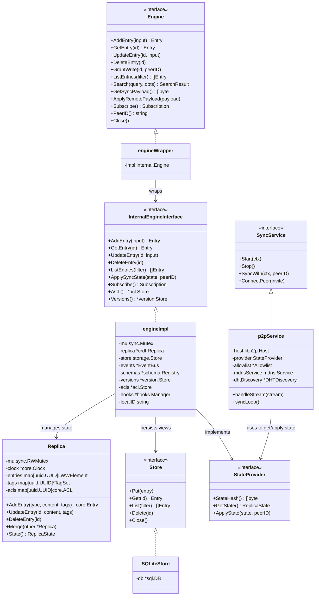
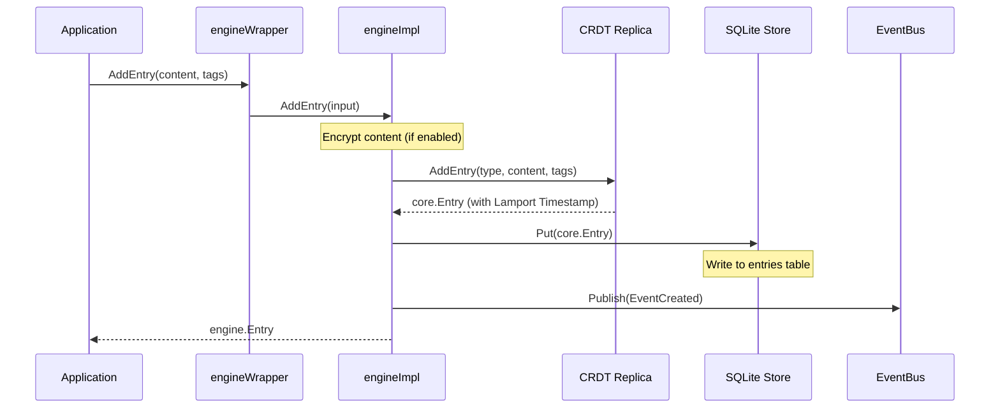
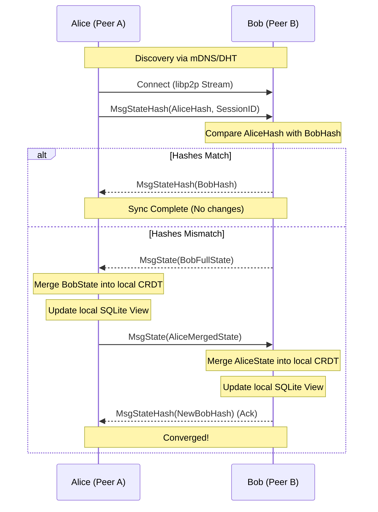
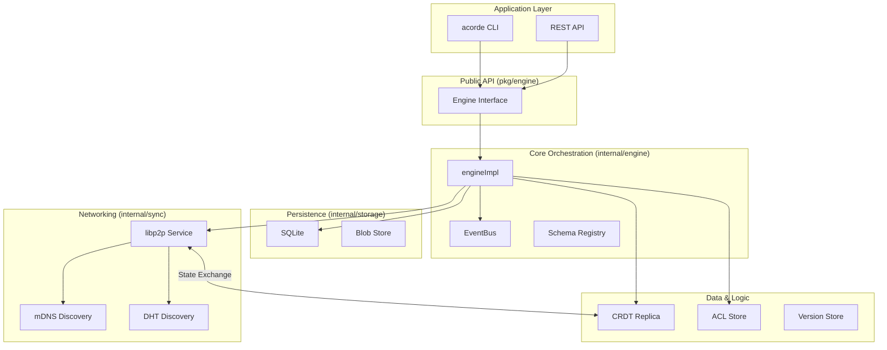

# Acorde UML Documentation

This document provides a visual representation of the Acorde architecture using Mermaid UML diagrams.

## 1. Class Diagram (System Architecture)

The following diagram shows the main components of the Acorde system and their relationships.

## 2. Sequence Diagram: Data Write Flow

This diagram illustrates what happens when a user adds a new entry via the Engine API.

## 3. Sequence Diagram: P2P Synchronization Flow

This diagram shows the "Pull-Push" synchronization protocol between two peers (Alice and Bob).

## 4. Component Diagram

